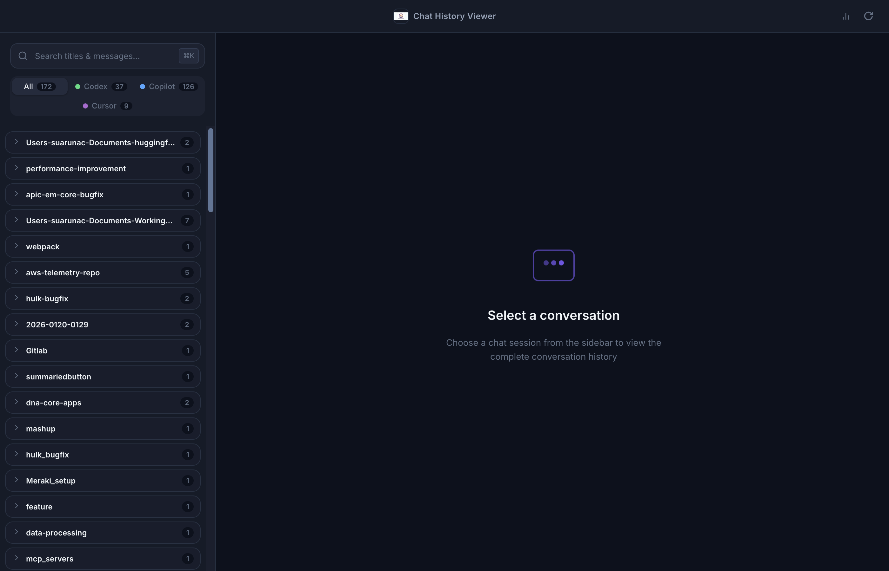
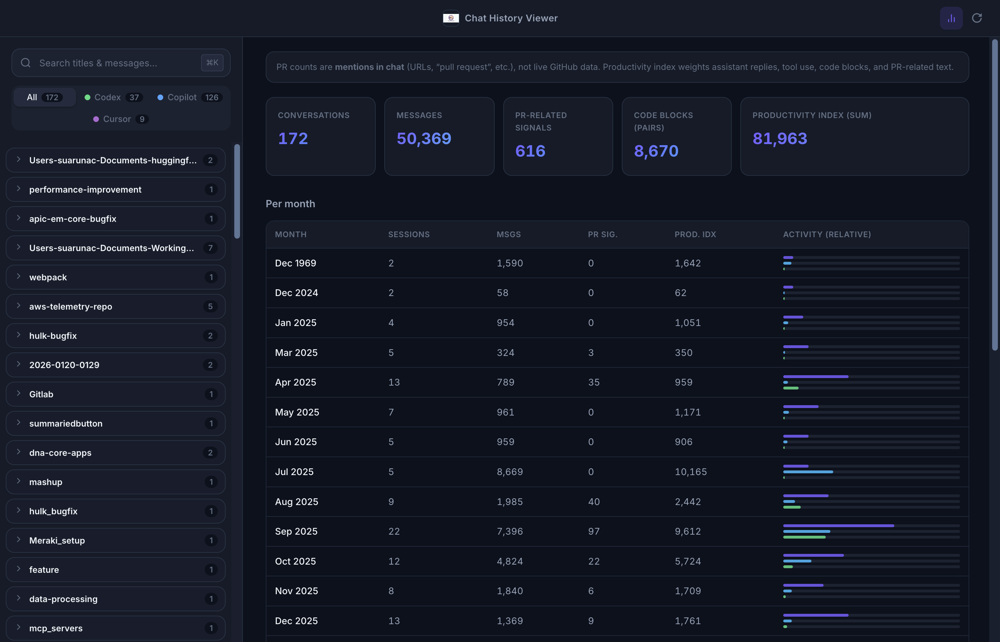
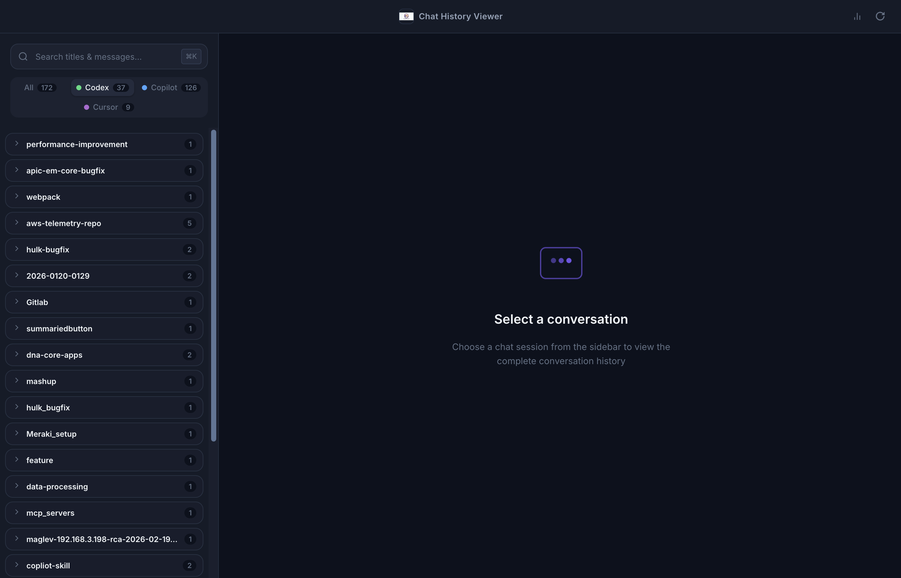
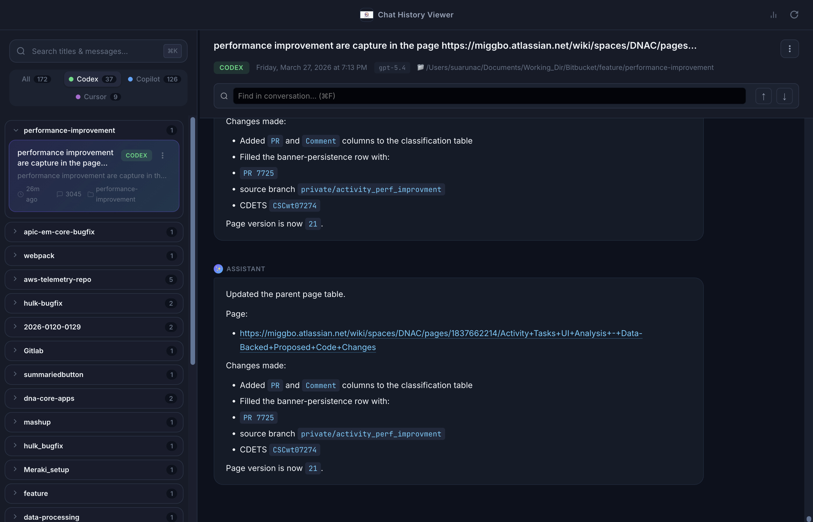

# Chat History Viewer

A desktop application that **reads your local AI coding chat history** from **OpenAI Codex CLI**, **GitHub Copilot** (VS Code family), and **Cursor**, and presents it in one searchable, browsable interface—with optional **usage analytics**.

Everything runs **on your machine**. No accounts, no cloud sync, and no data leaves your computer unless you export or copy it yourself.

**Repository:** [github.com/arsujay/comman-chat-history](https://github.com/arsujay/comman-chat-history)

### Download (macOS — Apple Silicon)

| | |
|--|--|
| **DMG (recommended)** | [ChatHistoryViewer-1.0.300-arm64.dmg](https://github.com/arsujay/comman-chat-history/releases/download/v1.0.300/ChatHistoryViewer-1.0.300-arm64.dmg) |
| **ZIP** | [ChatHistoryViewer-1.0.300-arm64.zip](https://github.com/arsujay/comman-chat-history/releases/download/v1.0.300/ChatHistoryViewer-1.0.300-arm64.zip) |

*Version `1.0.300` is the CI/build train until a stable DMG is published from Actions; then we’ll align semver again.*

**All releases:** [github.com/arsujay/comman-chat-history/releases](https://github.com/arsujay/comman-chat-history/releases) · **Latest:** [releases/latest](https://github.com/arsujay/comman-chat-history/releases/latest) (open **Assets** if you need a different version).

Open the **DMG**, drag **Chat History Viewer** into **Applications**, then launch it from Launchpad or Applications.

---

## Screenshots

| Main window (empty state) | Usage dashboard |
|:-:|:-:|
|  |  |

| Sidebar filters & folders | Conversation view (with a session open) |
|:-:|:-:|
|  |  |

**Regenerate** these images (uses your **local** chat history for the conversation screenshot if sessions exist):

```bash
npm run screenshots
```

Requires `npm run vite:build` output (the script runs the build first). Uses Electron with `CHAT_HISTORY_VIEWER_USE_DIST=1` so the packaged `dist/` UI is captured without a dev server.

---

## What it does

| Source | Where it reads from (typical) |
|--------|-------------------------------|
| **Codex CLI** | `~/.codex/sessions`, archived sessions, rollout `*.jsonl` files |
| **GitHub Copilot** | macOS: `~/Library/Application Support/Code/User/workspaceStorage` (VS Code–compatible chat threads) |
| **Cursor** | `~/.cursor/projects/<project>/agent-transcripts/` |

The app **parses** those files, normalizes sessions, and shows:

- A **session list** grouped by **workspace / folder** (working directory or project name).
- **Full transcripts** with Markdown rendering and syntax highlighting for code blocks.
- **Search** across titles and message bodies (including when threads are not loaded in the UI).
- A **usage dashboard** with per-month activity and heuristic “productivity” metrics (see below).

---

## Features

### Session browser

- **Filters:** All, Codex, Copilot, Cursor.
- **Search:** Debounced search over stored message text (`⌘K` focuses search).
- **Folders:** Sessions grouped by repo/workspace; **accordion** behavior (one expanded folder at a time); folders ordered by **most recent activity**.
- **Resizable sidebar:** Drag the divider between the list and the main pane; width is remembered locally.

### Conversation view

- Renders assistant and user messages with **Markdown** and **highlight.js** for code fences.
- **Find in conversation** (`⌘F` / `⌘G` / `⇧⌘G`) inside the active thread.
- **Scroll to top** when you are not at the latest messages.
- **Context menu** (⋮) on sessions: copy IDs, paths, Codex resume snippets, etc., depending on source (implemented in the Electron main process).

### Usage dashboard

Open the **bar-chart** control in the title bar to switch from chats to the dashboard.

The dashboard shows:

- **Totals:** conversation count, message count, estimated **code-block** usage (markdown fences), and a **productivity index** (heuristic).
- **Per month:** sessions, messages, **PR-related text signals**, and the same index—plus small relative bar indicators.
- **Top workspaces / repos** by session count.
- **Latest month** split by source (Codex / Copilot / Cursor).

**Important:** “PR” numbers are **not** live GitHub data. They count **mentions in chat** (for example `github.com/.../pull/...`, phrases like “pull request”, `gh pr`, etc.). Treat them as a rough signal of how often you discussed PRs in AI chats, not as merged PR counts.

### Desktop shell

- **Electron** app with a **custom title bar** (macOS-friendly traffic lights region).
- **Refresh** reloads parsers and invalidates the session cache.

---

## Requirements

- **Node.js 22+** (see `.nvmrc`; run `nvm use` if you use nvm). Older Node versions may fail Vite 6 builds.
- **pnpm** (recommended) or **npm** — `pnpm-lock.yaml` is the source of truth for CI; `package-lock.json` remains for `npm install` if you prefer.

## Releases

Prebuilt **macOS** installers (**DMG** and **ZIP** for Apple Silicon) are published on **[GitHub Releases](https://github.com/arsujay/comman-chat-history/releases)**.

The [release workflow](.github/workflows/release.yml) uses **pnpm** (not npm) on macOS runners — npm often crashes on GitHub’s macOS images with `Exit handler never called!`. Pushing a tag like **`v1.0.300`** runs `pnpm install --frozen-lockfile`, then `pnpm run build:ci`, then uploads **DMG + ZIP** with the GitHub CLI.

See [CHANGELOG.md](CHANGELOG.md) for version notes.

Supported platforms for **development:** macOS is the primary target (paths for Copilot storage match macOS VS Code layout). **Built installers** are configured for macOS (DMG/ZIP), Windows (NSIS/portable), and Linux (AppImage) via `electron-builder`; path assumptions for Copilot on Windows/Linux may need verification.

---

## Quick start

```bash
git clone https://github.com/arsujay/comman-chat-history.git
cd comman-chat-history
corepack enable && pnpm install
# or: npm install
```

### Development (Vite + Electron)

```bash
npm run dev
```

This starts the Vite dev server on port **5173** and launches Electron when the dev server is ready.

### Production build (web assets + packager)

```bash
npm run vite:build    # builds `src/` → `dist/`
npm run build         # Vite build + electron-builder (output under `release/`)
```

`npm run pack` builds the app **unpacked** under `release/` for quick testing without a full installer.

---

## Project layout

```
comman-chat-history/
├── electron/           # Main process: IPC, menus, parsers, dashboard aggregation
│   ├── main.js
│   ├── preload.js
│   ├── dashboardStats.js
│   ├── sessionFs.js
│   └── parsers/        # codex.js, copilot.js, cursor.js
├── src/                # Renderer (Vite): UI, components, styles
│   ├── index.html
│   ├── main.js
│   ├── index.css
│   └── components/
├── public/             # Static assets served / copied for build
├── dist/               # Vite output (generated)
└── release/            # electron-builder output (generated)
```

---

## Tech stack

- **Electron** — desktop shell, filesystem access, native menus.
- **Vite** — dev server and bundling of the renderer.
- **Vanilla JS** (ES modules) for the UI—no React/Vue dependency in the shipped app.
- **highlight.js** (CDN in `index.html`) for code block highlighting in messages.

---

## Privacy & security

- Data is read **only from local paths** on your machine.
- No telemetry or analytics are sent to a backend by this app.
- **Credentials:** do not commit API keys or tokens; this repo is intended to stay free of secrets.

---

## Contributing

Issues and pull requests are welcome. When changing parsers, keep behavior aligned with on-disk formats used by Codex / VS Code / Cursor, which can change between product versions.

---

## License

No license file is bundled in this repository yet. If you plan to open-source formally, add a `LICENSE` file and set `"license"` in `package.json`.

---

## Acknowledgments

Built for developers who juggle **Codex**, **Copilot**, and **Cursor** and want a **single place** to review and search past AI conversations—**offline**, on **your** hardware.
